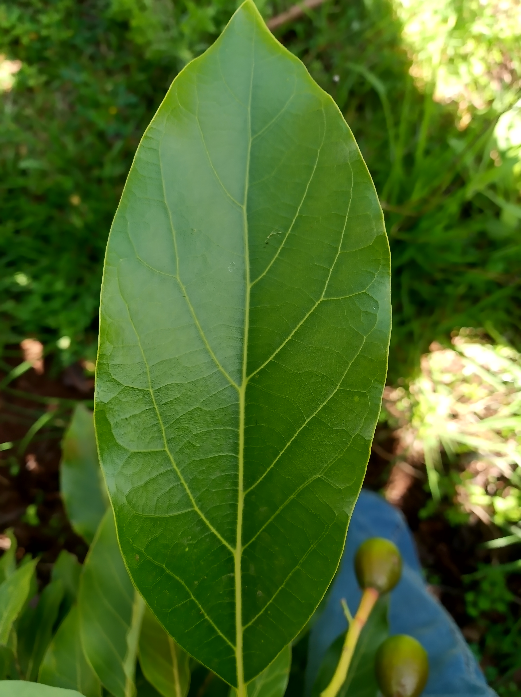
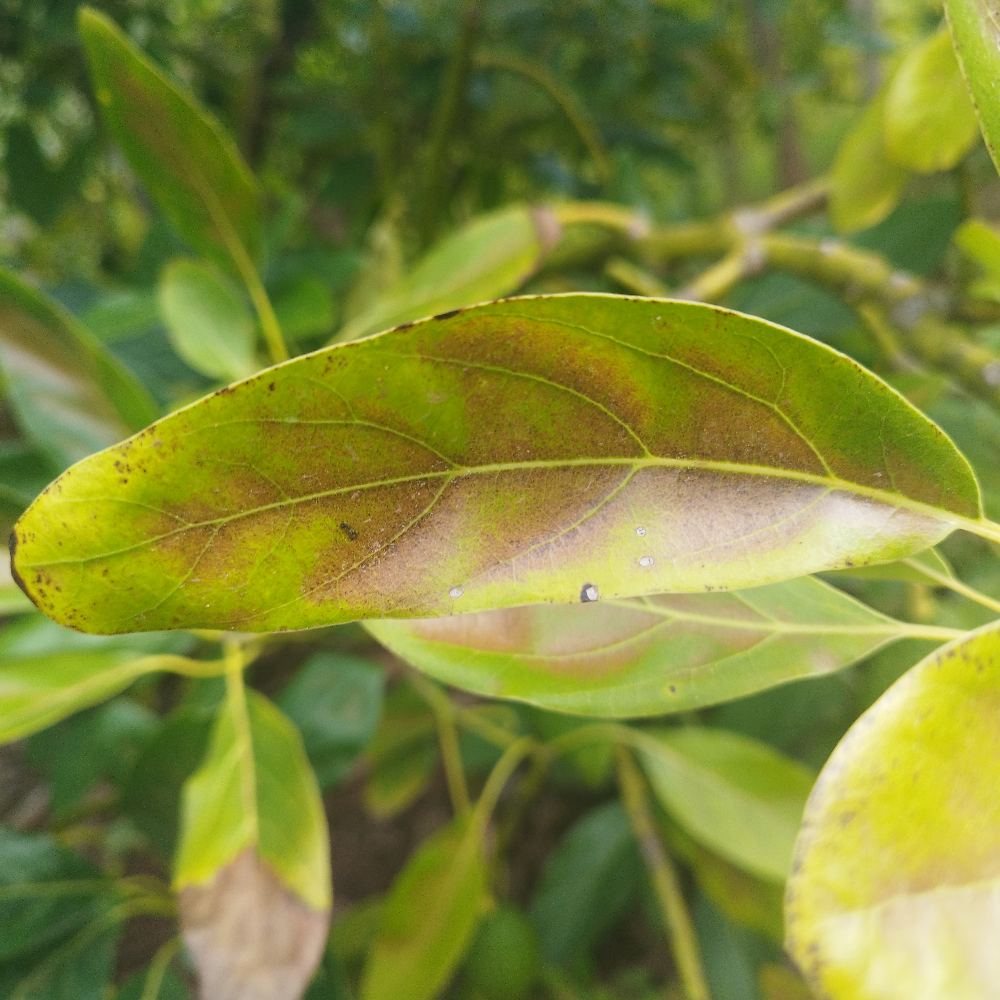
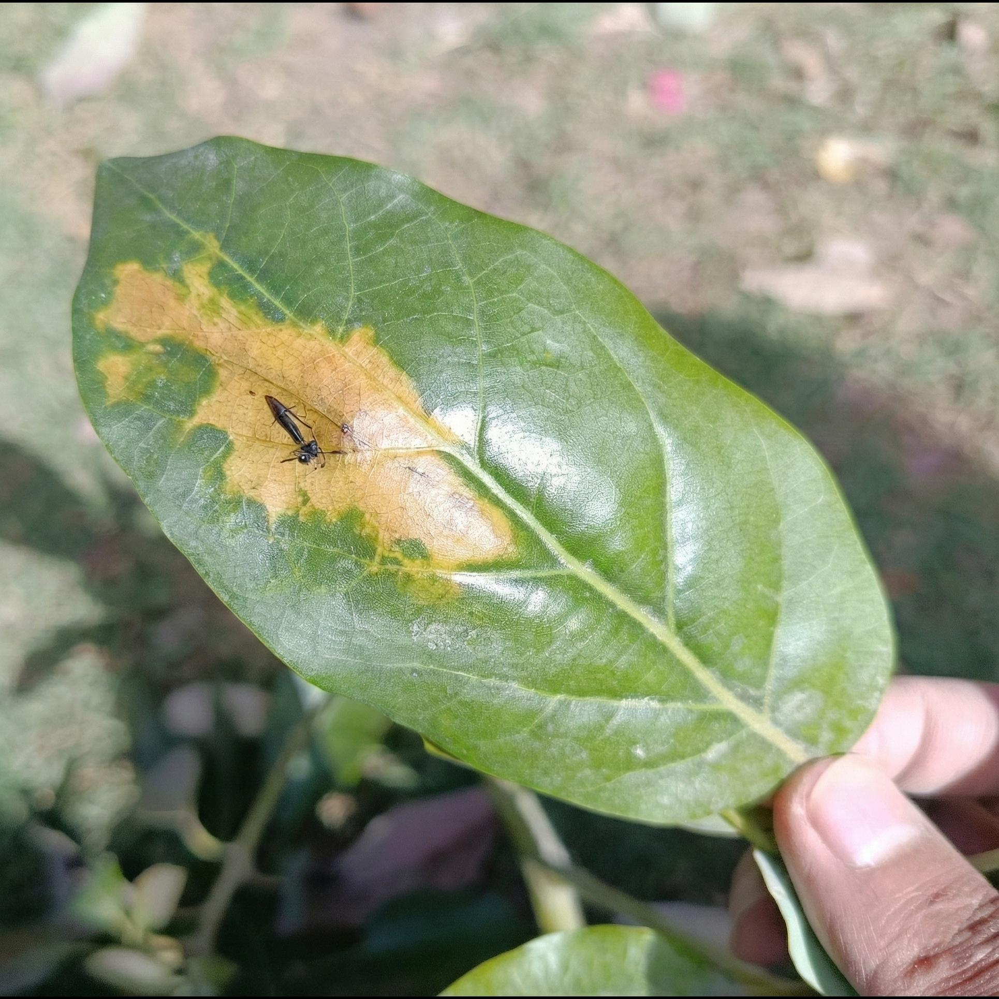
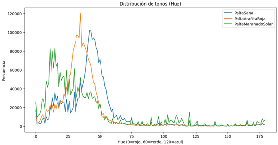
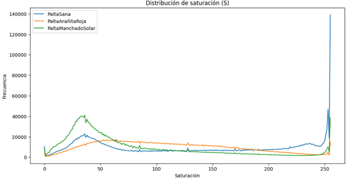
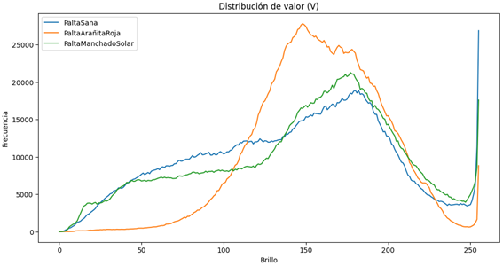
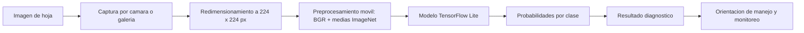
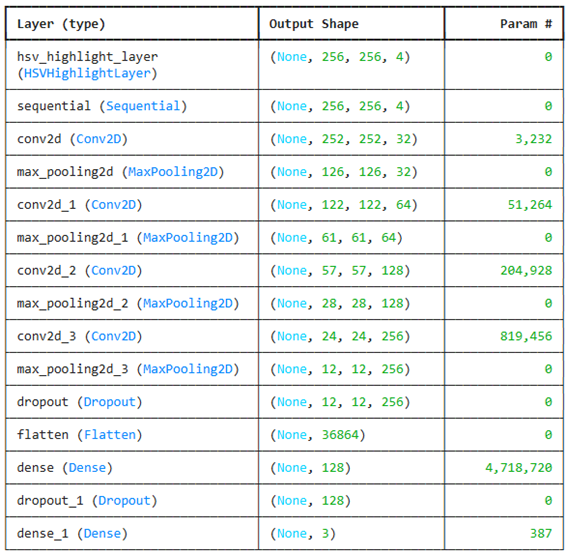
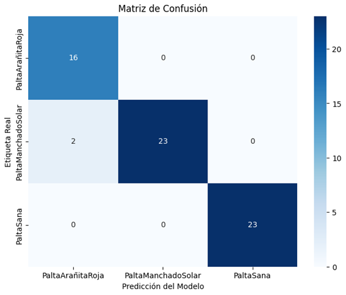
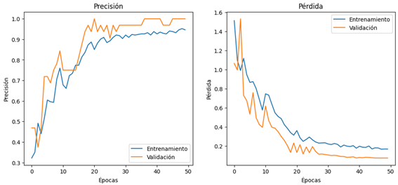

<div align="center">
  

  <h1>Paltodoc</h1>

  <p>
    <strong>Diagnostico foliar asistido por vision computacional para el cultivo de palta</strong>
  </p>

  <p>
    Aplicacion Android nativa con inferencia local mediante TensorFlow Lite, orientada a la deteccion temprana de anomalias visuales en hojas de palto.
  </p>

  <p>
    <a href="https://developer.android.com"></a>
    <a href="https://kotlinlang.org"></a>
    <a href="https://www.tensorflow.org/lite"></a>
    
    
  </p>
</div>

---

## Resumen

**Paltodoc** es un prototipo de investigacion aplicada que explora el uso de redes neuronales convolucionales para apoyar el reconocimiento visual de anomalias foliares en cultivos de palta. El sistema fue disenado como una aplicacion Android nativa capaz de capturar o seleccionar una imagen de hoja, normalizarla, ejecutar un modelo de TensorFlow Lite dentro del dispositivo y presentar una orientacion inicial al usuario.

El proyecto nace de una necesidad concreta: muchos pequenos productores no cuentan con acceso inmediato a diagnostico fitosanitario especializado, especialmente en contextos rurales donde la conectividad, el tiempo de respuesta y el costo de evaluacion pueden limitar la toma de decisiones. Paltodoc propone una herramienta de apoyo, no un reemplazo del criterio agronomico, que acerca el analisis visual asistido por inteligencia artificial a escenarios de campo.

La version actual clasifica imagenes en tres categorias:

- **Palta con arañita roja**, asociada a sintomas visuales de dano por acaros.
- **Palta con manchado solar**, tratada como una categoria visual de alteracion foliar.
- **Palta sana**, correspondiente a hojas sin evidencia visual dominante de las anomalias evaluadas.

---

## Tabla De Contenidos

- [Resumen](#resumen)
- [Pregunta De Investigacion](#pregunta-de-investigacion)
- [Objetivos](#objetivos)
- [Alcance Biologico](#alcance-biologico)
- [Metodologia](#metodologia)
- [Arquitectura Del Sistema](#arquitectura-del-sistema)
- [Modelo De Vision Computacional](#modelo-de-vision-computacional)
- [Resultados Experimentales](#resultados-experimentales)
- [Aplicacion Android](#aplicacion-android)
- [Estructura Del Repositorio](#estructura-del-repositorio)
- [Instalacion Y Ejecucion](#instalacion-y-ejecucion)
- [Limitaciones Cientificas](#limitaciones-cientificas)
- [Ruta De Investigacion](#ruta-de-investigacion)
- [Equipo](#equipo)

---

## Pregunta De Investigacion

> ¿En que medida un modelo de vision computacional ejecutado localmente en un telefono Android puede apoyar la identificacion temprana de anomalias foliares en palta, manteniendo un balance razonable entre precision experimental, costo computacional y usabilidad en campo?

Esta pregunta orienta el proyecto hacia tres dimensiones complementarias:

- **Exactitud tecnica:** capacidad del modelo para diferenciar patrones visuales entre clases.
- **Viabilidad computacional:** posibilidad de ejecutar inferencia en un dispositivo movil sin depender de servidores externos.
- **Utilidad contextual:** entrega de informacion comprensible para productores, estudiantes o tecnicos que necesiten una primera orientacion.

---

## Objetivos

### Objetivo General

Desarrollar y evaluar un prototipo movil de diagnostico foliar asistido por inteligencia artificial para clasificar imagenes de hojas de palta en categorias fitosanitarias visuales relevantes.

### Objetivos Especificos

- Construir una aplicacion Android nativa para captura, seleccion y visualizacion de imagenes foliares.
- Integrar un modelo de clasificacion en formato TensorFlow Lite para inferencia local.
- Evaluar distintas configuraciones convolucionales mediante experimentacion controlada.
- Documentar metricas de rendimiento, matriz de confusion y curvas de entrenamiento.
- Presentar resultados de forma clara, prudente y util para un entorno academico y agricola.
- Identificar limitaciones metodologicas para orientar futuras mejoras del sistema.

---

## Alcance Biologico

El sistema trabaja con categorias visuales de interes agronomico. La clasificacion se basa en patrones morfologicos y cromaticos presentes en la imagen, por lo que debe interpretarse como una **herramienta de tamizaje visual**.

| Categoria | Interpretacion Visual | Observaciones |
| --- | --- | --- |
| Arañita roja | Punteaduras, zonas cloroticas o bronceadas y cambios de tonalidad asociados a dano por acaros. | Puede requerir confirmacion por inspeccion directa del enves, presencia de acaros o evaluacion tecnica. |
| Manchado solar | Alteraciones foliares con patrones amarillentos, quemaduras o manchas irregulares. | En esta version se trata como categoria visual; no constituye diagnostico etiologico definitivo. |
| Sana | Hoja con coloracion verde predominante y sin senales visuales fuertes de las anomalias consideradas. | No descarta problemas no visibles, infecciones tempranas o estres no expresado en la imagen. |

<div align="center">
  <table>
    <tr>
      <td align="center"><strong>Hoja sana</strong></td>
      <td align="center"><strong>Arañita roja</strong></td>
      <td align="center"><strong>Manchado solar</strong></td>
    </tr>
    <tr>
      <td align="center"></td>
      <td align="center"></td>
      <td align="center"></td>
    </tr>
  </table>
</div>

---

## Metodologia

La metodologia combina desarrollo movil, aprendizaje profundo y validacion experimental. El flujo general puede resumirse en cinco etapas:

1. **Recoleccion y organizacion de imagenes:** agrupacion de muestras por categoria visual.
2. **Exploracion cromatica:** analisis de distribuciones en componentes HSV para observar variaciones de tono, saturacion e intensidad.
3. **Entrenamiento experimental:** evaluacion de arquitecturas convolucionales con distinta profundidad y tamano de kernel.
4. **Seleccion del modelo:** comparacion de exactitud, perdida y estabilidad entre configuraciones.
5. **Despliegue movil:** exportacion del modelo a TensorFlow Lite e integracion en una aplicacion Android nativa.

<div align="center">
  <table>
    <tr>
      <td></td>
      <td></td>
      <td></td>
    </tr>
  </table>
  <p><em>Exploracion de distribuciones HSV utilizada para estudiar variaciones cromaticas en el material foliar.</em></p>
</div>

---

## Arquitectura Del Sistema



La aplicacion evita depender de una API externa para la inferencia. El archivo del modelo se encuentra en:

```text
app/src/main/assets/modelo_palta_vgg16.tflite
```

Esta decision favorece:

- **Privacidad:** la imagen no necesita salir del dispositivo para obtener una prediccion.
- **Disponibilidad:** el diagnostico puede ejecutarse aun con conectividad limitada.
- **Tiempo de respuesta:** la salida se genera localmente, sin latencia de red.
- **Portabilidad:** el prototipo puede evaluarse en telefonos Android compatibles.

---

## Modelo De Vision Computacional

El modelo documentado combina una etapa de realce cromatico y una arquitectura convolucional supervisada para clasificacion multiclase. La arquitectura experimental seleccionada utiliza cuatro bloques convolucionales con kernel 5x5, seguidos por capas densas de decision.

<div align="center">
  
</div>

### Caracteristicas Tecnicas

| Componente | Descripcion |
| --- | --- |
| Entrada esperada | Imagen RGB redimensionada a 224 x 224 px en la aplicacion Android. |
| Preprocesamiento movil | Conversion a orden BGR y resta de medias ImageNet: 103.939, 116.779 y 123.68. |
| Motor de inferencia | `org.tensorflow:tensorflow-lite:2.14.0`. |
| Formato de despliegue | TensorFlow Lite (`.tflite`). |
| Salida | Vector de 3 probabilidades, una por clase. |
| Clases en Android | `Arañita Roja`, `Manchado Solar`, `Sana`. |

> Nota tecnica: el archivo desplegado se denomina `modelo_palta_vgg16.tflite`. El nombre conserva la convencion historica del experimento movil; la documentacion del repositorio registra tambien la arquitectura convolucional evaluada y sus resultados.

---

## Resultados Experimentales

La experimentacion comparo 12 configuraciones, variando profundidad de red y tamano del kernel convolucional. Los resultados completos se encuentran en [`Resultados.xlsx`](./Resultados.xlsx).

| Capas Convolucionales | Kernel | Accuracy | Loss | Lectura Experimental |
| :---: | :---: | :---: | :---: | --- |
| 2 | 3x3 | 87.50% | 0.3086 | Capacidad limitada para separar clases complejas. |
| 2 | 5x5 | 93.75% | 0.1636 | Mejor separacion visual, aun con profundidad reducida. |
| 2 | 7x7 | 62.50% | 0.7045 | Campo receptivo amplio con perdida de detalle local. |
| 3 | 3x3 | 95.31% | 0.1539 | Buen equilibrio inicial entre detalle local y abstraccion. |
| 3 | 5x5 | 90.62% | 0.3311 | Rendimiento inferior al esperado para esta profundidad. |
| 3 | 7x7 | 92.19% | 0.2305 | Costo mayor sin ganancia clara de generalizacion. |
| 4 | 3x3 | 90.62% | 0.1599 | Captura local adecuada, pero menos robusta. |
| **4** | **5x5** | **96.88%** | **0.0947** | **Configuracion seleccionada por mayor exactitud y menor perdida.** |
| 4 | 7x7 | 85.94% | 0.3809 | Perdida de resolucion espacial util para lesiones pequenas. |
| 5 | 3x3 | 93.75% | 0.1027 | Arquitectura mas compleja sin mejora decisiva. |
| 5 | 5x5 | 92.19% | 0.1638 | Posible redundancia estructural. |
| 5 | 7x7 | 53.12% | 0.7668 | Deterioro severo del rendimiento experimental. |

### Modelo Seleccionado

| Metrica | Valor |
| --- | ---: |
| Accuracy global | 96.88% |
| Precision macro | 97.22% |
| Recall macro | 96.88% |
| F1-score macro | 96.90% |
| Support de prueba | 64 imagenes |
| Test loss | 0.0947 |

### Matriz De Confusion Y Curvas De Entrenamiento

<div align="center">
  <table>
    <tr>
      <td></td>
      <td></td>
    </tr>
  </table>
</div>

La matriz de confusion registra 62 aciertos sobre 64 muestras de prueba. La clase **Arañita Roja** alcanza recall de 100% en el conjunto evaluado, lo cual es relevante porque los falsos negativos en problemas fitosanitarios pueden retrasar acciones de monitoreo. La clase **Sana** tambien alcanza recall de 100%, reduciendo falsos avisos sobre hojas visualmente normales dentro del conjunto experimental.

---

## Aplicacion Android

La aplicacion esta implementada como cliente Android nativo. El usuario puede tomar una fotografia con la camara o seleccionar una imagen desde galeria. Luego, el sistema ejecuta la inferencia local y muestra una ficha de resultado con el diagnostico visual y recomendaciones iniciales.

### Funcionalidades Implementadas

- Pantalla de bienvenida (`SplashActivity`) con transicion hacia el modulo principal.
- Modulo de diagnostico con entrada por camara o galeria.
- Redimensionamiento de imagen a 224 x 224 px.
- Inferencia local con TensorFlow Lite.
- Biblioteca informativa de anomalias foliares.
- Vista de equipo y contexto del proyecto.
- Dialogo inferior con certeza del modelo y orientacion inicial de manejo.

### Stack Android

| Capa | Tecnologia |
| --- | --- |
| Lenguaje | Kotlin |
| SDK | `compileSdk 34`, `minSdk 24`, `targetSdk 34` |
| Build system | Gradle Kotlin DSL |
| UI | XML layouts, AppCompat, Material Components, ConstraintLayout |
| Inferencia | TensorFlow Lite, TensorFlow Lite Support, Select TF Ops |
| Modelo | `modelo_palta_vgg16.tflite` en assets |

---

## Estructura Del Repositorio

```text
Paltodoc/
  app/
    src/main/
      assets/
        modelo_palta_vgg16.tflite
      java/org/tesis/paltodoc/
        MainActivity.kt
        SplashActivity.kt
      res/
        layout/
        drawable/
        values/
  docs/
    architecture/
      model_summary.png
    eda/
      hue_distribution.png
      saturation_distribution.png
      value_distribution.png
    metrics/
      confusion_matrix.png
      accuracy_curve.png
    samples/
      hoja_sana_sin_enfermedad.jpg
      hoja_eferma_arañita_roja1.jpg
      hoja_eferma_manchado_solar1.jpg
  Resultados.xlsx
  README.md
```

---

## Instalacion Y Ejecucion

### Requisitos

- Android Studio.
- JDK compatible con Android Gradle Plugin 8.x.
- Dispositivo o emulador Android con API 24 o superior.
- Gradle Wrapper incluido en el repositorio.

### Compilar En Windows

```powershell
.\gradlew.bat assembleDebug
```

### Compilar En Linux/macOS

```bash
./gradlew assembleDebug
```

### Ejecutar En Android Studio

1. Abrir la carpeta del proyecto en Android Studio.
2. Sincronizar Gradle.
3. Seleccionar un emulador o dispositivo fisico.
4. Ejecutar el modulo `app`.
5. Probar la clasificacion desde camara o galeria.

---

## Limitaciones Cientificas

Paltodoc debe entenderse como un prototipo academico de apoyo al diagnostico visual. Sus resultados no reemplazan evaluaciones agronomicas, analisis de laboratorio ni protocolos oficiales de manejo fitosanitario.

Limitaciones actuales:

- El conjunto de prueba documentado contiene 64 imagenes, por lo que se requiere validacion ampliada antes de uso productivo.
- La variacion de camaras, iluminacion, angulo, fondo y estado fenologico puede afectar la prediccion.
- La categoria "manchado solar" se trata como clase visual; no confirma por si sola una causa biologica, viral, abiotica o nutricional.
- El modelo no estima severidad, area afectada ni progresion temporal.
- Las recomendaciones mostradas son orientativas y deben contrastarse con criterio tecnico local.
- El archivo `.tflite` supera 80 MB; una siguiente version deberia explorar cuantizacion, poda o arquitecturas mas ligeras.

---

## Ruta De Investigacion

- Ampliar el dataset con mas zonas, variedades, condiciones de luz y estadios de dano.
- Incorporar validacion cruzada y evaluacion por dispositivo.
- Registrar precision, recall, F1 y matriz de confusion por lote de datos.
- Evaluar modelos livianos como MobileNetV3, EfficientNet-Lite o arquitecturas CNN compactas.
- Medir latencia de inferencia, consumo de memoria y tamano final del APK.
- Agregar segmentacion de hoja para reducir influencia del fondo.
- Desarrollar una guia de captura fotografica para mejorar consistencia de datos.
- Incluir trazabilidad de muestras y metadatos agronomicos.
- Preparar una version de campo con historial de diagnosticos y exportacion de reportes.

---

## Equipo

- **Max William Medina Castro** - desarrollo movil, integracion de IA, documentacion tecnica y arquitectura de producto.
- **Pablo Rodrigo Damiano Cana** - apoyo en desarrollo, evaluacion y validacion del proyecto.
- **Luis Miguel Curo Medina** - apoyo en investigacion, revision y documentacion.

---

## Declaracion De Uso Responsable

Paltodoc busca democratizar el acceso a herramientas de observacion agricola asistida por inteligencia artificial. Su proposito es educativo, experimental y de apoyo tecnico. Toda decision de manejo en campo debe considerar inspeccion directa, criterios agronomicos, normativa local y acompanamiento especializado cuando sea necesario.
